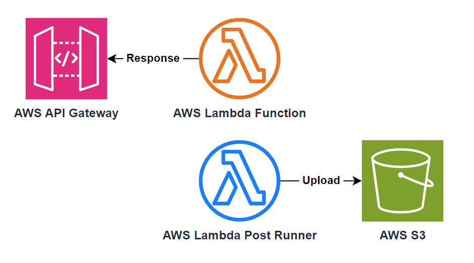

# AWS Lambda Post Runner

Run a command after the lambda handler function returns.

This is helpful if you want to response to the synchronous invoker (e.g. API gateway) as soon as possible then run some tasks after that (e.g. uploading logs to S3, sending metrics to CloudWatch).

## Usage

### As a Lambda Layer

1. Download the prebuilt zip from the [release page](https://github.com/DiscreteTom/aws-lambda-post-runner/releases/latest). You can also build it yourself by running `cargo build --release`, then zip `scripts/entry.sh` with `target/release/aws-lambda-post-runner`.
2. Upload the zip as a lambda layer. Add the layer to your lambda function.
3. Add an environment variable `AWS_LAMBDA_EXEC_WRAPPER` to the lambda function with the value `/opt/entry.sh` to enable the runner.
4. Configure the [environment variables](#environment-variables) below to set the command you want to run.

### As a Binary Executable

If you are using a custom lambda runtime (for rust, golang, c++, etc) or container image, you can run the filter as a parent process of your main handler process.

1. Download the prebuilt zip from the [release page](https://github.com/DiscreteTom/aws-lambda-post-runner/releases/latest) to get the `aws-lambda-post-runner` executable. You can also build it yourself by running `cargo build --release`.
2. Modify the entry command of the lambda function to `aws-lambda-post-runner <handler-command> <handler-args>`
3. Configure the [environment variables](#environment-variables) below to set the command you want to run.

### Environment Variables

- `AWS_LAMBDA_POST_RUNNER_COMMAND` (required)
  - The command to run after the lambda handler function returns.

## FAQ

- Q: Will this save my money by running some logic after the lambda handler returns?
  - No. The lambda charges until the post runner finishes.
- Q: How can I verify that the command is executed after the lambda handler returns?
  - Try to set the command to something like `sleep 10 && echo done` then invoke the lambda via API Gateway. You should see your HTTP response immediately and the logs show `done` after 10 seconds.
- Q: Can I bring my own binary executable and run it in the command?
  - Yes. E.g. you can package your binary executable in a lambda layer. [When you add a layer to a function, Lambda loads the layer content into the `/opt` directory of that execution environment](https://docs.aws.amazon.com/lambda/latest/dg/packaging-layers.html#packaging-layers-paths). You can use `/opt/xxx` to run your binary.
- Q: How does this work?
  - By using [AWS Lambda Runtime Proxy](https://github.com/DiscreteTom/aws-lambda-runtime-proxy) this tool can intercept the lambda handler function's return value and run the command after that.

## [CHANGELOG](./CHANGELOG.md)
